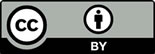

## An Introduction to Data Science

```
Laurent Gatto                      Computational Proteomics Unit
https://lgatto.github.io           University of Cambridge
lg390@cam.ac.uk                    @lgatt0
```

Slides: [http://bit.ly/20170608osio](https://rawgit.com/lgatto/2017_06_08_osio_London/master/slides.html)

### License

These slides are available under a
[**creative common CC-BY**](http://creativecommons.org/licenses/by/4.0/)
license. You are free to **share** (copy and redistribute the material
in any medium or format) and **adapt** (remix, transform, and build
upon the material) for any purpose, even commercially.



