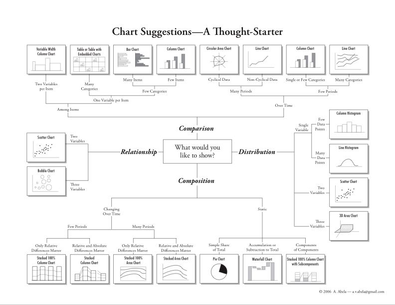
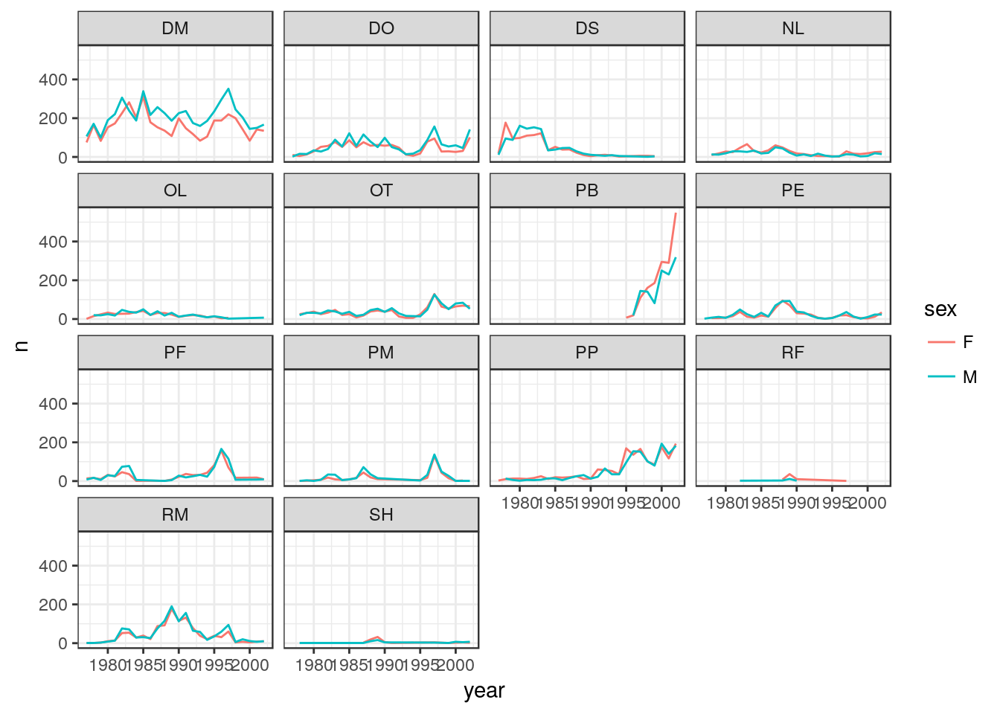
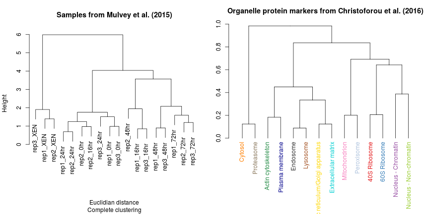
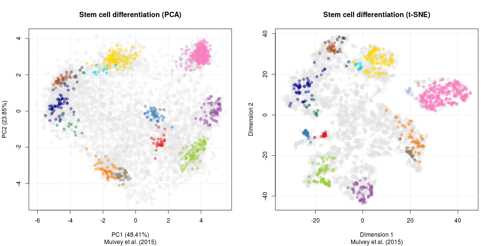
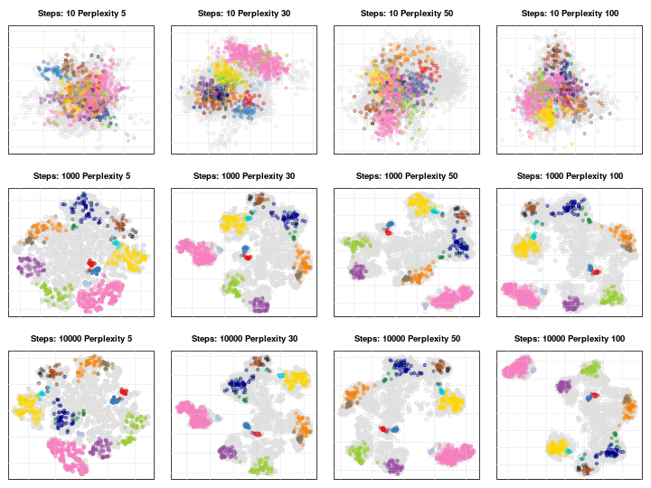

## An Introduction to Data Science

```
Laurent Gatto                      Computational Proteomics Unit
https://lgatto.github.io           University of Cambridge
lg390@cam.ac.uk                    @lgatt0
```

Slides: http://bit.ly/20170608osio


```
```
Last update `r date()`

##

These slides are available under a
[**creative common CC-BY**](http://creativecommons.org/licenses/by/4.0/)
license. You are free to **share** (copy and redistribute the material
in any medium or format) and **adapt** (remix, transform, and build
upon the material) for any purpose, even commercially.


## About me 

* Senior Research Associate 
* Computational biology
* Open Scientist, Data Champion
* Software Sustainability Institute fellow
* Software and Data Carpentry instructor

More details: https://lgatto.github.io/about/


## Content

- Data analyis
- Data
- Visualisation
- Methodologies
- Tools

# Data analysis

## Data analysis


> Data analysis is the process by which data becomes understanding,
> knowledge and insight. -- Hadley Wickham

The ability to prepare and **explore** data, identify **patterns**
(good and pathological ones) and convincingly demonstrate that the
patterns are **genuine** (rather than random).

It's not analysing data, it's *investigating* data - requires flexibility.

##

  


## And also

* Reproducibility/replicability
* Automation
* Plain text: tracking, re-use, share, communicable


`Programming`,  but:

* Learning curve (although, I would argue that the
reflecting/investigating/analysing the data is the real challenge)

## To analyse data, you don't need to

* ~~Be a programmer~~
* ~~Be a computer scientist~~
* ~~Be a statistician/machine learner~~

## To analyse data, you need

* ~~Be a programmer~~
* ~~Be a computer scientist~~
* ~~Be a statistician/machine learner~~
* Knowledge about the domain
* Know about your data
* Be able to manipulate/visualise it
* How good do we need to be? **Good enough**


# Data

## Data

- continuous
- categorical
- character
- integers, floats
- follows a certain distribution

## Data

- spread sheets, databases
- text based, binary (requires special libraries to read)
- csv, json, XML
- big or small
- structured on un-structured
- tidy or messy
- known or new


## Data cleaning

> The time spent (wasted?) into cleaning up messy data is often
> greater than the time spen in actually analysing the data.

### Examples:
- wrong encoding: typos, character vs numbers
- missing values

# Visualisation

## Visualisation

> Graphics reveal data.

> Visualization can surprise you, but it doesn’t scale well. Modeling
> scales well, but it can’t surprise you. -- Hadley Wickham


##



## Use case: Anscombe's quartet

Let's use the famous
[*Anscombe's quartet*](https://en.wikipedia.org/wiki/Anscombe%27s_quartet)
data as a motivating example. This data is composed of 4 pairs of
values, $(x_1, y_1)$ to $(x_4, y_4)$:

## 

<div style="font-size:78%">
```{r anscombe, echo = FALSE, results='asis'}
library("knitr")
kable(anscombe, align = "cccccccc")
```
</div>
## Summary statistics

Each of these $x$ and $y$ sets have the same variance, mean and
correlation:

```{r anscombetab, echo=FALSE}
tab <- matrix(NA, 5, 4)
colnames(tab) <- 1:4
rownames(tab) <- c("var(x)", "mean(x)",
                   "var(y)", "mean(y)",
                   "cor(x,y)")

for (i in 1:4)
    tab[, i] <- c(var(anscombe[, i]),
                  mean(anscombe[, i]),
                  var(anscombe[, i+4]),
                  mean(anscombe[, i+4]),
                  cor(anscombe[, i], anscombe[, i+4]))

```

```{r anstabdisplay, echo=FALSE}
kable(tab)
```

## { .fullpage }


```{r anscombefig, echo=FALSE}
ff <- y ~ x

mods <- setNames(as.list(1:4), paste0("lm", 1:4))

par(mfrow = c(2, 2), mar = c(4, 4, 1, 1))
for (i in 1:4) {
    ff[2:3] <- lapply(paste0(c("y","x"), i), as.name)
    plot(ff, data = anscombe, pch = 19, xlim = c(3, 19), ylim = c(3, 13))
    mods[[i]] <- lm(ff, data = anscombe)
    abline(mods[[i]])
}
```

## The Datasaurus Dozen dataset

See also another, more recent example:
[The Datasaurus Dozen dataset](https://www.autodeskresearch.com/publications/samestats).


## From data to figure

An example for the [Data Carpentry R](http://www.datacarpentry.org/R-ecology-lesson/04-visualization-ggplot2.html#plotting_time_series_data) course. 

Ecological surveys data: visualisating the number of captures of each
species and each sex over time.

## { .fullpage }


| record_id | month | day | year | species_id | sex | weight | hindfoot_length |
|:---------:|:-----:|:---:|:----:|:----------:|:---:|:------:|:---------------:|
|    934    |   5   | 19  | 1978 |     DS     |  F  |  114   |       47        |
|   8637    |  11   | 13  | 1983 |     OL     |  M  |   39   |       20        |
|   26755   |   7   | 30  | 1997 |     DM     |  M  |   47   |       35        |
|   32080   |   5   | 26  | 2001 |     NL     |  F  |  205   |       32        |
|   17624   |   6   | 22  | 1990 |     DO     |  M  |   48   |       37        |
|   17196   |   2   | 25  | 1990 |     RM     |  M  |   9    |       17        |
|   8808    |  12   |  9  | 1983 |     DM     |  F  |   32   |       35        |
|   17972   |  11   | 10  | 1990 |     DM     |  M  |   39   |       36        |

## { .fullpage }


| year | species_id | sex | n  |
|:----:|:----------:|:---:|:--:|
| 1978 |     PM     |  F  | 1  |
| 2001 |     DO     |  M  | 46 |
| 1994 |     PF     |  F  | 43 |
| 1979 |     RM     |  M  | 3  |
| 1990 |     DO     |  M  | 99 |
| 1989 |     PF     |  M  | 5  |
| 1987 |     PF     |  F  | 2  |
| 2002 |     PF     |  M  | 9  |

## { .fullpage }




# Methodologies

## Methodologies

- Data transformation
- Unsupervised learning - clustering
- Hierarchical clustering
- Dimensionality reduction
- Supervised learning - classification


## Data transformation

- centering
- scaling
- log-scale
- binning
- normalisation (removing technical variation)

## { .fullpage }

```{r scale, echo=FALSE, fig.width=14, fig.height=7}
set.seed(1L)
x <- cbind(rnorm(10), rnorm(10, 10, 10), rnorm(5, 0.1))
par(mfrow = c(1, 2))
boxplot(x, main = "Original data")
boxplot(scale(x), main = "Scaled and centered")
```

## { .fullpage }

```{r log, echo=FALSE, warning=FALSE, fig.width=14, fig.height=7}
suppressPackageStartupMessages(library(Biobase))
data(sample.ExpressionSet)
par(mfrow = c(1, 2))
plot(exprs(sample.ExpressionSet)[, 1:2], main = "Original data")
plot(log2(exprs(sample.ExpressionSet)[, 1:2]), main = "log2 transformed")
```

## Machine learning

- *Unsupervised machine learning (clustering)* is the task of inferring
  hidden structure from "unlabeled" data.
- *Supervised machine learning (classification)* is the problem of
  identifying to which of a set of categories (sub-populations) a new
  observation belongs

(From Wikipedia)

## Hierarchical clustering

Hierarchical clustering methods start by calculating all pairwise
distances between all observations and then clusters/groups these
based on these similarities. There are various distances measures and
clustering algorithms that can be used.

## { .fullpage }




## Dimensionality reduction

When the data span over many dimensions (more than 2 or 3, up to
thousands), it becomes impossible to easily visualise it in its
entirety. *Dimensionality reduction* techniques such as **PCA** or
**t-SNE** will transform the data into a new space that summarise
properties of the whole data set along a reduced number of
dimensions. These are then used to visualise the data along these
informative dimensions or perform calculations more efficiently.


## Principal Component Analysis

Principal Component Analysis (PCA) is a technique that transforms the
original n-dimentional data into a new n-dimentional space. Along
these new dimensions, called principal components, the data expresses
most of its variability along the first PC, then second, .... These
new dimensions are *linear combinations* of the orignal data.

## {.fullpage}


## {.fullpage}


## t-Distributed Stochastic Neighbour Embedding

t-Distributed Stochastic Neighbour Embedding (t-SNE) is a *non-linear*
dimensionality reduction techique, i.e. that different regions of the
data space will be subjected to different transformations. In t-SNE
will compress small distances, thus bringing close neighbours
together, and will ignore large distances.

## { .fullpage }





## Parameter tuning

t-SNE has two important parameters that can substantially influence
the clustering of the data

- **Perplexity**: balances global and local aspects of the data.
- **Iterations**: number of iterations before the clustering is
  stopped.

It is important to adapt these for different data.

## { .fullpage }



## K-means

Starting with a pre-specified number of cluster (random) centres, each
point is initally assigned to its nearest centre. In the next step,
the centres are moved to the centroid of the clustered points. The
points are then reassigned to their nearest centre. The process is
repeated until moving the centres derives little or no improvement
(measured by the within cluster sum of squares - the total squared
distance between each point and its cluster centre). 

Source: [Clustering with Scikit with GIFs](https://dashee87.github.io/data%20science/general/Clustering-with-Scikit-with-GIFs/)

## { .fullpage }


## { .fullpage }

```{r kmeans, echo=FALSE, fig.width=12, fig.height=4}
set.seed(1L)
x <- rbind(matrix(rnorm(100, sd = 0.3), ncol = 2),
           matrix(rnorm(100, mean = 1, sd = 0.3), ncol = 2))
par(mfrow = c(1, 3))
colnames(x) <- c("x", "y")
plot(x, main = "Original data")
cl <- kmeans(x, 2)
plot(x, col = cl$cluster, main = "2 clusters")
points(cl$centers, col = 1:2, pch = 8, cex = 2)
cl <- kmeans(x, 5, nstart = 25)
plot(x, col = cl$cluster, main = "5 clusters")
points(cl$centers, col = 1:5, pch = 8)
```

## { .fullpage }

```{r kmeans2, echo=FALSE, fig.width=12, fig.height=4}
par(mfrow = c(1, 3))
x <- matrix(rnorm(100), ncol = 2)
colnames(x) <- c("x", "y")
plot(x, main = "Random data")
cl <- kmeans(x, 2)
plot(x, col = cl$cluster, main = "2 clusters")
points(cl$centers, col = 1:2, pch = 8, cex = 2)
cl <- kmeans(x, 5, nstart = 25)
plot(x, col = cl$cluster, main = "5 clusters")
points(cl$centers, col = 1:5, pch = 8)
```

## Supervised learning - classification

*Supervised machine learning (classification)* is the problem of
identifying to which of a set of categories (sub-populations) a new
observation belongs.

We have a set of annotated or labelled data points, for which the
category (class) is known, and unlabelled data, for which we want to
infer the most probably class.

## { .fullpage }

```{r iris, echo=FALSE}
## data
set.seed(1L)
tr <- sample(150, 100)
.pca <- prcomp(iris[, 1:4])$x
plot(.pca, main = "Iris")
points(.pca[tr, ], col = as.numeric(iris[tr, "Species"])+1,
       pch = 19, cex = 1.1)
legend("topright", levels(iris[tr, "Species"]),
       pch = 19, col = 2:4, bty = "n")
```

## { .fullpage }

Classification is performed in 2 steps

1. Train a classifier, tune its parameters (build a classification
   model) using labelled data.
2. Use the model to classify unlabelled data.

## Nearest neighbours - kNN

The class of each unlabelled example, is defined by performing a
majority vote using the classes of its *k* nearest neighbours.

What value of *k* should we use?

(Images on next slides are from
[An Introduction to Statistical Learning](http://www-bcf.usc.edu/~gareth/ISL/))

## { .fullpage }


## Cross-validation

1. We test a range a possible values for *k* and check how well they
   perform.
2. To assess the performance, we use the labelled data. 80% are used
   to train a classifier (**training data**), and the remaining 20% are
   considered unlabelled and re-classified (**test data**).
3. By comparing to obtained and the expected labels, we can assess the
   error rate or **classification accuracy**.

## { .fullpage }


# Tools

## Data analysis tools

should enables you to **manipulate** your data, give some guarantees
about the **integrity** of the data, support effective
**extract/subset** components of the data, **visualise** them, enable
**transformation** of the data, give access to infrastucture for
**statistical analysis**, and enable **annotation** of the data.

## Data analysis tools

* Store data as *computational objects* (rigorously defined data
  structures): knowing where to find things
* Consistency in data structures (and conventions)
* Easily manipluate/transform/visualise these data (*Application
  programming interface*)


## Tools

- R and RStudio
- Python 
- Jupyter notebooks

