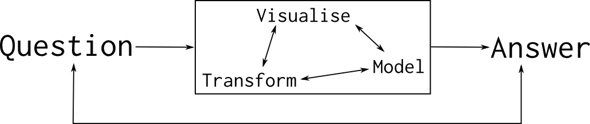
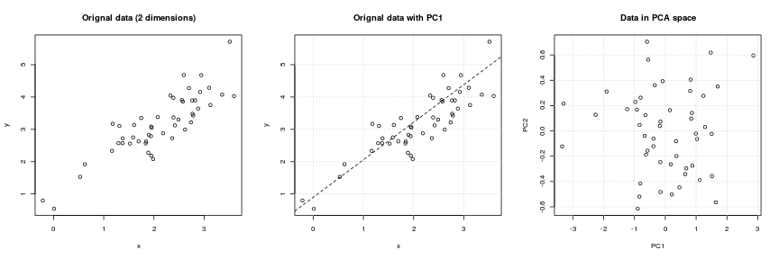

## An Introduction to Data Science

> Using Data Sets for Analytics

```
Laurent Gatto                      Computational Proteomics Unit
https://lgatto.github.io           University of Cambridge
lg390@cam.ac.uk                    @lgatt0
```

Slides: http://bit.ly/20170608osio


```
```

##

These slides are available under a
[**creative common CC-BY**](http://creativecommons.org/licenses/by/4.0/)
license. You are free to **share** (copy and redistribute the material
in any medium or format) and **adapt** (remix, transform, and build
upon the material) for any purpose, even commercially.


## About me 

* Senior Research Associate 
* Computational biology
* Open Scientist, Data Champion
* Software Sustainability Institute fellow
* Software and Data Carpentry instructor

More details: https://lgatto.github.io/about/

## Data analysis


> Data analysis is the process by which data becomes understanding,
> knowledge and insight. -- Hadley Wickham

The ability to prepare and **explore** data, identify **patterns**
(good and pathological ones) and convincingly demonstrate that the
patterns are **genuine** (rather than random).

It's not analysing data, it's *investigating* data - requires flexibility.

##

  


## And also

* Reproducibility/replicability
* Automation
* Plain text: tracking, re-use, share, communicable


`Programming`,  but:

* Learning curve (although, I would argue that the
reflecting/investigating/analysing the data is the real challenge)

## To analyse data, you don't need to

* ~~Be a programmer~~
* ~~Be a computer scientist~~
* ~~Be a statistician/machine learner~~

## To analyse data, you need

* ~~Be a programmer~~
* ~~Be a computer scientist~~
* ~~Be a statistician/machine learner~~
* Knowledge about the domain
* Know about your data
* Be able to manipulate/visualise it
* How good do we need to be? **Good enough**

## Data

- spread sheets, databases
- text based, binary (requires special libraries to read)
- csv, json, XML
- big or small
- structured on un-structured
- tidy or messy
- known or new

## Data cleaning

> The time spent (wasted?) into cleaning up messy data is often
> greater than the time spen in actually analysing the data.

Examples:
- wrong encoding: typos, character vs numbers
- missing values

## Visualisation

> Graphics reveal data.

> Visualization can surprise you, but it doesn’t scale well. Modeling
> scales well, but it can’t surprise you. -- Hadley Wickham


##


## Use case: Anscombe's quartet

Let's use the famous
[*Anscombe's quartet*](https://en.wikipedia.org/wiki/Anscombe%27s_quartet)
data as a motivating example. This data is composed of 4 pairs of
values, $(x_1, y_1)$ to $(x_4, y_4)$:

## 

<div style="font-size:78%">
```{r anscombe, echo = FALSE, results='asis'}
library("knitr")
kable(anscombe, align = "cccccccc")
```
</div>
## Summary statistics

Each of these $x$ and $y$ sets have the same variance, mean and
correlation:

```{r anscombetab, echo=FALSE}
tab <- matrix(NA, 5, 4)
colnames(tab) <- 1:4
rownames(tab) <- c("var(x)", "mean(x)",
                   "var(y)", "mean(y)",
                   "cor(x,y)")

for (i in 1:4)
    tab[, i] <- c(var(anscombe[, i]),
                  mean(anscombe[, i]),
                  var(anscombe[, i+4]),
                  mean(anscombe[, i+4]),
                  cor(anscombe[, i], anscombe[, i+4]))

```

```{r anstabdisplay, echo=FALSE}
kable(tab)
```

## { .fullpage }


```{r anscombefig, echo=FALSE}
ff <- y ~ x

mods <- setNames(as.list(1:4), paste0("lm", 1:4))

par(mfrow = c(2, 2), mar = c(4, 4, 1, 1))
for (i in 1:4) {
    ff[2:3] <- lapply(paste0(c("y","x"), i), as.name)
    plot(ff, data = anscombe, pch = 19, xlim = c(3, 19), ylim = c(3, 13))
    mods[[i]] <- lm(ff, data = anscombe)
    abline(mods[[i]])
}
```

## The Datasaurus Dozen dataset

See also another, more recent example:
[The Datasaurus Dozen dataset](https://www.autodeskresearch.com/publications/samestats).


## Methodologies

- Data transformation
- Unsupervised learning - clustering
- Hierarchical clustering
- Dimensionality reduction
- Supervised learning - classification
- Regression


## Data transformation

- centering
- scaling
- log-scale

## Hierarchical clustering

Hierarchical clustering methods start by calculating all pairwise
distances between all observations and then clusters/groups these
based on these similarities. There are various distances measures and
clustering algorithms that can be used.

## { .fullpage }


## Dimensionality reduction

When the data span over many dimensions (more than 2 or 3, up to
thousands), it becomes impossible to easily visualise it in its
entirety. *Dimensionality reduction* techniques such as **PCA** or
**t-SNE** will transform the data into a new space that summarise
properties of the whole data set along a reduced number of
dimensions. These are then used to visualise the data along these
informative dimensions or perform calculations more efficiently.


## Principal Component Analysis

Principal Component Analysis (PCA) is a technique that transforms the
original n-dimentional data into a new n-dimentional space. Along
these new dimensions, called principal components, the data expresses
most of its variability along the first PC, then second, .... These
new dimensions are *linear combinations* of the orignal data.

## {.fullpage}



## {.fullpage}


## t-Distributed Stochastic Neighbour Embedding

t-Distributed Stochastic Neighbour Embedding (t-SNE) is a *non-linear*
dimensionality reduction techique, i.e. that different regions of the
data space will be subjected to different transformations. In t-SNE
will compress small distances, thus bringing close neighbours
together, and will ignore large distances.

## { .fullpage }


## Parameter tuning

t-SNE has two important parameters that can substantially influence
the clustering of the data

- **Perplexity**: balances global and local aspects of the data.
- **Iterations**: number of iterations before the clustering is
  stopped.

It is important to adapt these for different data.

## { .fullpage }


                  
## Data analysis tools

should enables you to **manipulate** your data, give some guarantees
about the **integrity** of the data, support effective
**extract/subset** components of the data, **visualise** them, enable
**transformation** of the data, give access to infrastucture for
**statistical analysis**, and enable **annotation** of the data.

## Data analysis tools

* Store data as *computational objects* (rigorously defined data
  structures): knowing where to find things
* Consistency in data structures (and conventions)
* Easily manipluate/transform/visualise these data (*Application
  programming interface*)


## Tools

- R
- Python
